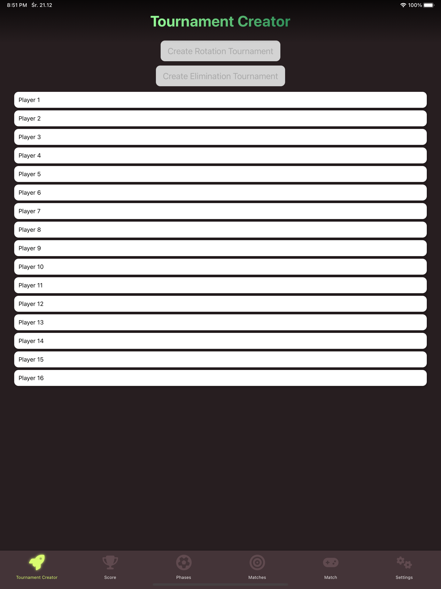
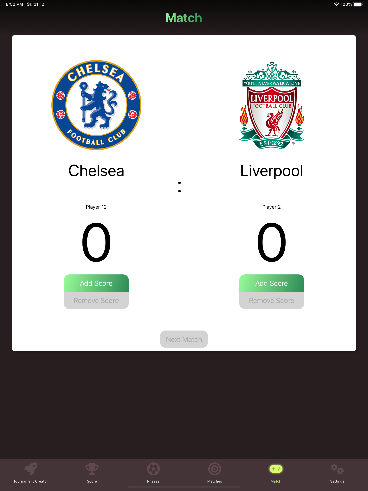
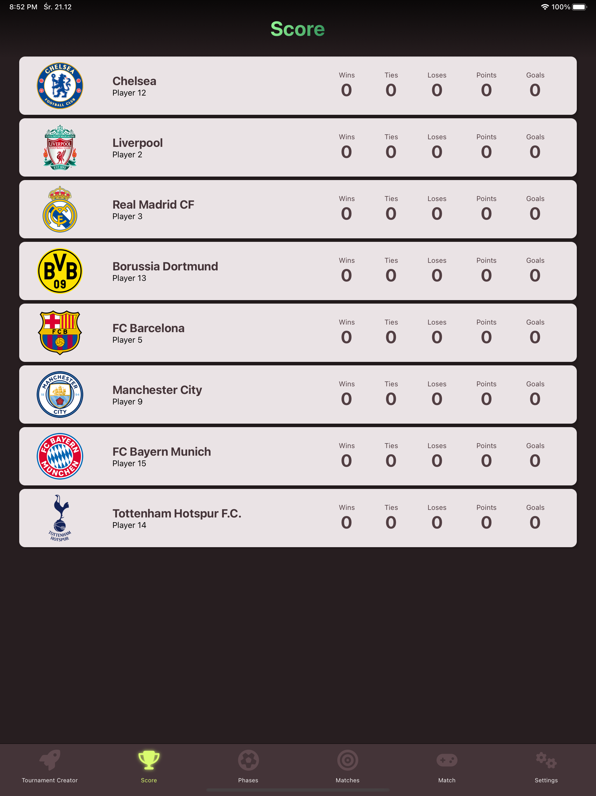
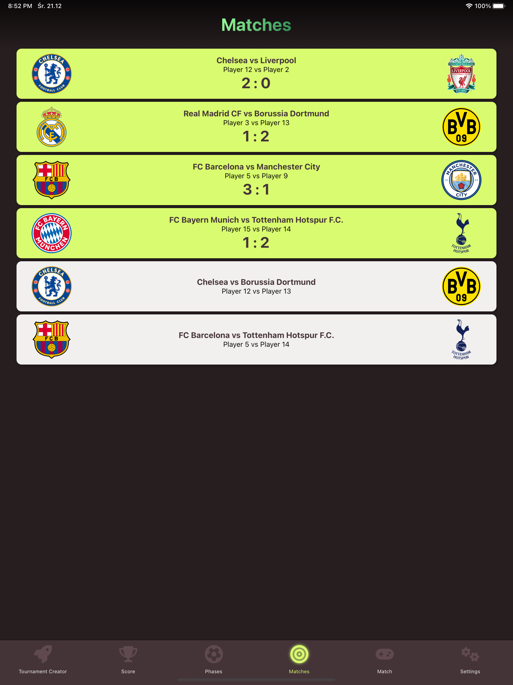
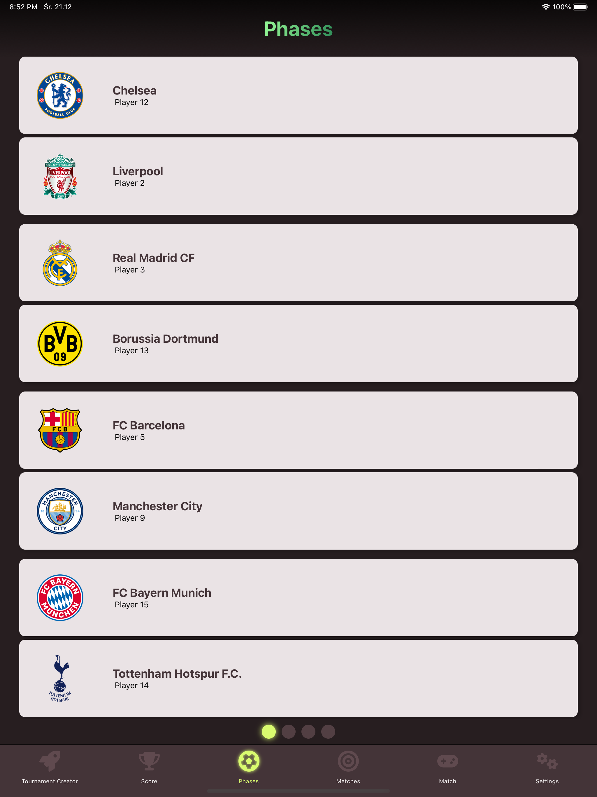
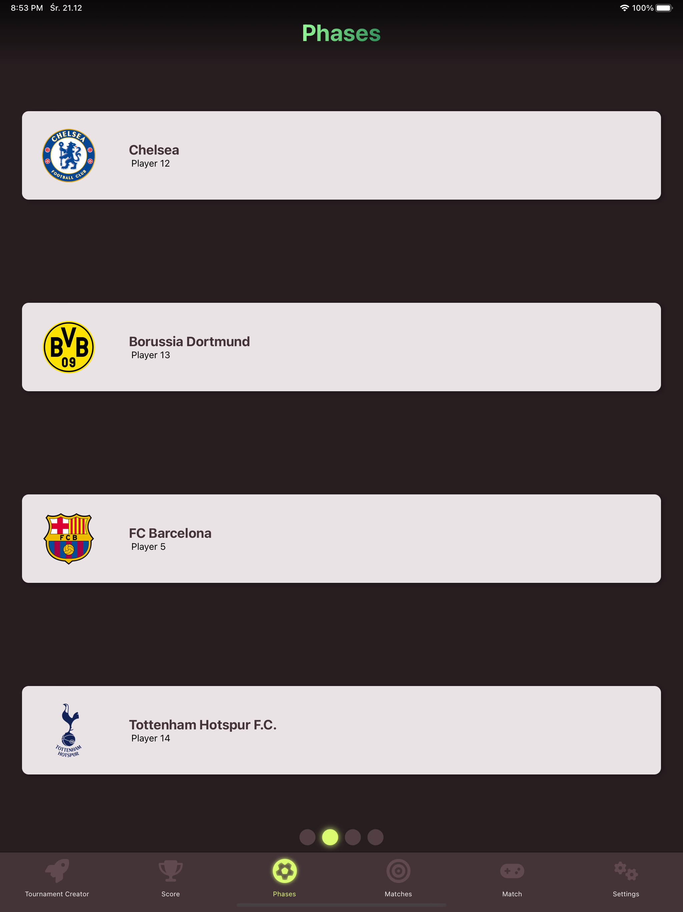
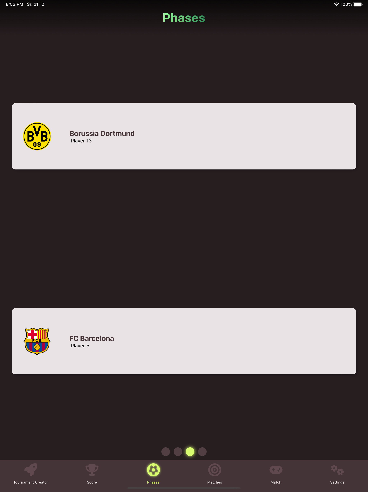
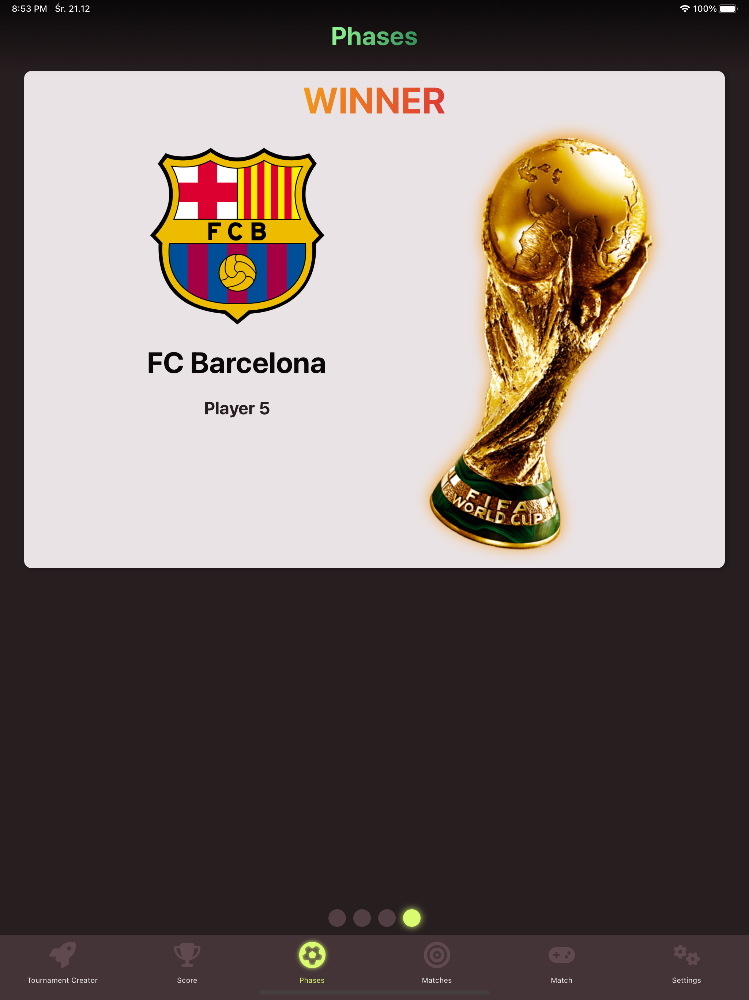

# UltimateTeamTournament

It's React Native App for iPad to shuffle chosen players and 12 preselected football clubs and make a tournament with knockout system or group system with saving score and goals.

### Chose players and tournament type

The tournament type depends on number of players: 6, 8, 12, 16 players can choose group or knockout type and only 8 and 16 players can choose knockout.

### Check the score and save current match

|Current match|Overall score|Played matches|
|----|----|----|
||||

### Tournament table

|Groups/Quaterfinals|Halffinals|Final|Winner|
|----|----|----|----|
|||||
